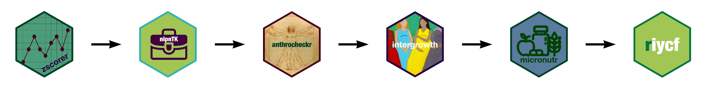

```{r setup, include = FALSE}
options(htmltools.dir.version = FALSE)

if(!require(remotes)) install.packages("remotes")
if(!require(fontawesome)) remotes::install_github("rstudio/fontawesome")
```

```{r xaringan-themer, include = FALSE}
library(xaringanthemer)
mono_light(
  base_color = "#004225",
  #title_slide_background_image = "figures/caseFindingCMAM.jpg",
  title_slide_background_size = "cover",
  link_color = "#250042",
  header_font_google = google_font("Fira Sans"),
  text_font_google   = google_font("Fira Sans Condensed"),
  code_font_google   = google_font("Fira Mono"),
  text_slide_number_font_size = "0.5em"
)
```

# The context

* part of a small team of nutrition practitioners that develop and implement various types of nutrition surveys;

* use of R not common among nutritionists, nutrition data analysts;

* team setup based on per project workflows with R scripts/code re-used by each project;

* R scripts shared by email and/or Dropbox with no use of any version control system.

---

# Solutions?

* Standardise and distribute our R scripts using workflows based on RAnalyticFlow

    * still faced issues with package dependencies
    
    * still had to move commonly used functions into each workflow created
    
    * workflow tool itself had cumbersome system and R dependencies (Java, rJava, JavaGD)
    
* Should we try to structure and distribute our code into R packages?

    * None of us knew how to develop R packages
    
    * The urgency of our existing project tasks outweighed the level of effort needed to learn and then develop R packages

---

# Biting the bullet

.pull-left[
* using time off from projects, learned how to create R packages with Hadley Wickham's ***R Packages*** book as a guide;

* learned version control using git and GitHub through the process of learning R package creation;

* started off with a simple data package to learn the basics, released on GitHub and then on CRAN;

* listed out and organised most commonly used R scripts to plan which packages to develop;

* released first package (`zscorer`) in mid-2018
]

.pull-right[

]

---

# Growing pains: running before we can walk

.pull-left[
* `zscorer` served our purposes well as we used the z-score calculation function in almost all of our nutrition survey projects;

* immediately started different projects for other commonly used functions each requiring varying levels of complexity;

* R package development capacity still remained at `n = 1` while the appetite for easily installable and distributable packages grew within small team;

* additional pressure of wanting to get packages released on CRAN!
]

.pull-right[

]

---

class: inverse, center, middle

# nutriverse packages so far



---

# Learning points and future plans

* Everything we were able to do so far has been made possible by an even larger ecosystem created, contributed to, and maintained by fellow individual and groups of R users

* Gain more capacity for R packages development - capacity building for other members of team and nurture a potential community of developers;

* Pre-release package/s to potential user base so that they can be used and tested in as many use cases as possible;

* Increase demand/use of existing packages within a sector that is not as familiar with R - capacity building on R and development of tools/products that are more accessible to others but uses packages developed


